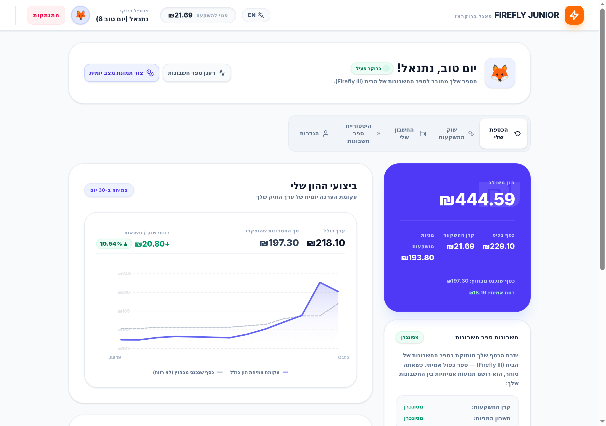
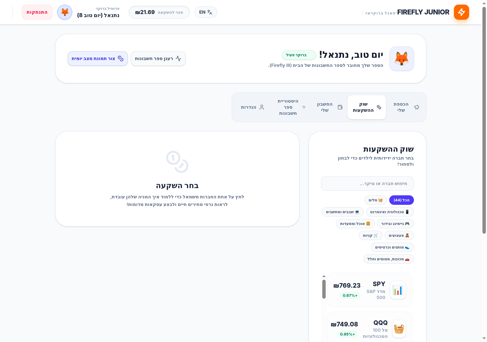
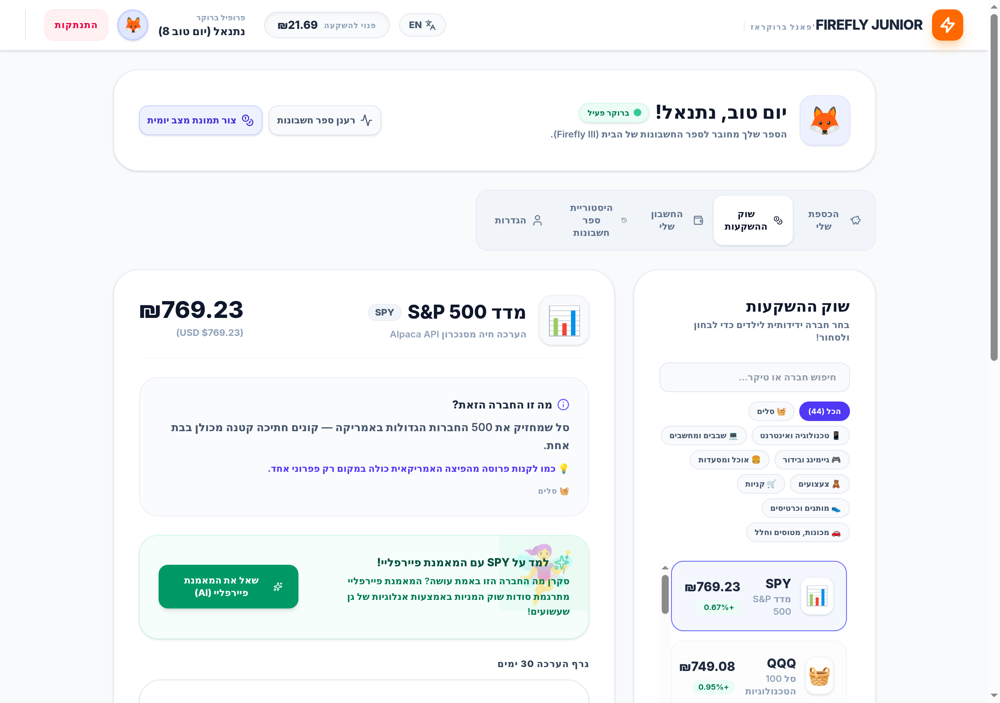
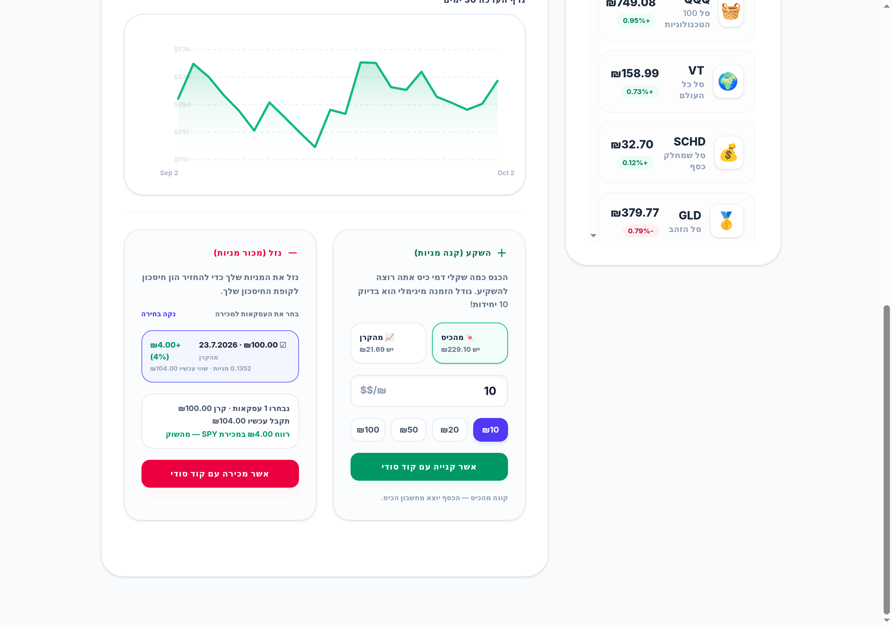
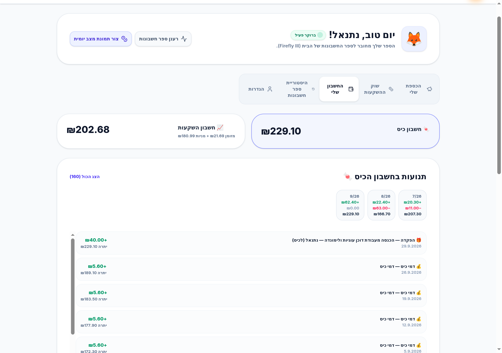
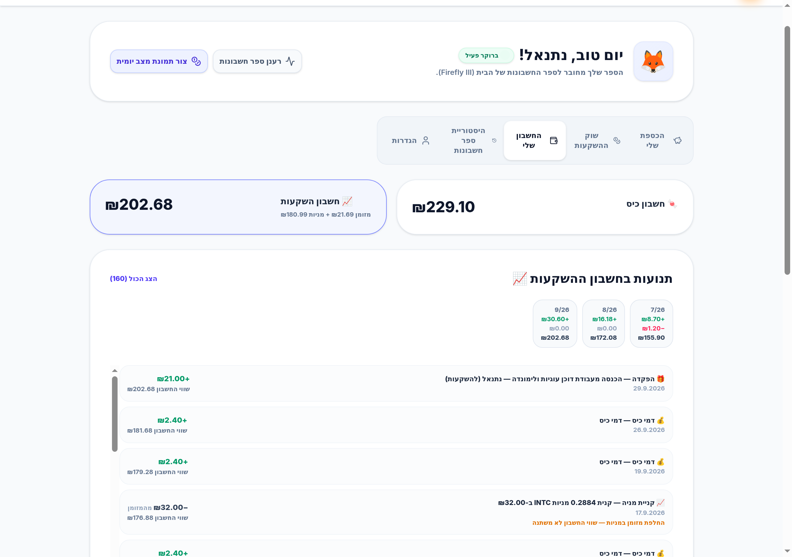
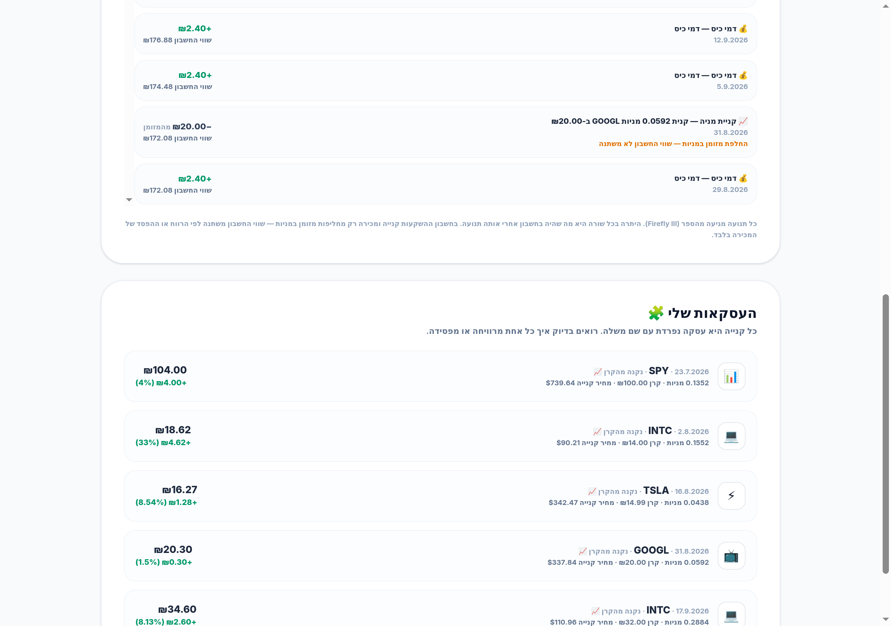

# 🔥 Firefly Junior Broker

A real brokerage, for kids. It was built so two children (8 and 6) could take their weekly
allowance, watch live stock prices, buy and sell **real companies** with their own money, and see
exactly what they made or lost — all of it recorded in a **double-entry ledger** (Firefly III)
where every single shekel can be traced. The whole app is in **Hebrew**, because a kid who can't
read the fine print can't learn from it.

The money is not real, but the prices are — Alpaca market data, to the agora. Nothing is a
simulation shortcut: when a child buys Intel, a real accounting entry moves the money, and when
he sells, he gets back exactly what that purchase earned, calculated from the ledger itself.

<br>

## Why it exists

> "Dad, can I buy Nintendo?"

Because that question deserves better than *"you're too young"*. This app turns it into a lesson
about saving, patience, ownership, and losing money — which happens, and is the most valuable part.

- **Real prices, not made-up ones.** Kids spot fake numbers instantly. Every price, every chart
  and every profit figure comes from live market data.
- **A real ledger, not a spreadsheet.** Every purchase opens a journal entry in Firefly III. The
  parents' own finance instance holds the children's accounts — the same tool the family already
  trusts, so "where did my money go?" is always answerable with a transaction id.
- **Honest profit.** The app never counts an allowance as investment success. The chart separates
  *money that came in from outside* from *money the market actually earned*.
- **No black boxes and no cheating.** Money cannot be moved between accounts, PINs gate every
  trade, and every rule is enforced on the server and covered by tests.
- **In Hebrew, from end to end.** Including the stock explanations, the error messages and the
  bank statement — written the way a child reads, not the way an accountant writes.

<br>

## What the kid sees

### The vault — the whole picture at a glance


Two accounts, one honest profit figure, and a chart with two lines: what he owns (blue) and what
was actually put in from outside (dashed). The gap between them is the only real profit.

### The market — 44 companies and baskets a child has heard of


Google, Minecraft's Microsoft, Roblox, Nintendo, McDonald's, Tesla — plus baskets that hold 500
companies at once, so "don't put all your eggs in one basket" is something he can do, not just hear.
Live prices, in shekels, updated from the market.

### Every stock explains itself


What the company actually does (in Hebrew, with a playground analogy), a real 30-day price chart,
and an AI coach that answers a kid's questions in a kid's language.

### Buy from the pocket or the fund — then sell the exact purchases you own


Buying asks which money pays: pocket money (🍬) or the investment fund (📈). Selling shows every
purchase he made, one by one, each with its own profit — and he chooses which ones to sell. The
result is named for what it is: *רווח ₪4.00 במכירת SPY — מהשוק* — "₪4.00 profit on the SPY sale,
paid by the market" — never after the grown-up who settles it.

### The pocket account — a bank statement he can read


Allowance in, spending out, a running balance after every movement, and a monthly summary. This is
where pocket money finally becomes a visible thing instead of an abstract number.

### The investing account — including the part grown-ups get wrong


A purchase swaps cash for stock, so the account's value doesn't change — the app says so out loud
instead of printing "+0.00". Profit and loss are named after the stock that was sold
(*"רווח במכירת TSLA"*), never after the parent who settles it.

### Every purchase is its own lot, with its own story


₪14 of Intel in August and ₪32 in September are two separate purchases with two separate results —
so the kid sees that investing well is a series of decisions, not one lucky guess.

<br>

## How the money works

**Two accounts.** 🍬 *pocket money* (spending) and 📈 *the investing account* (its balance is the
fund's cash **plus** the stocks at market value). The kid sees both, all the time.

**Allowance.** The parent records it in Firefly III — into the pocket, the fund or both. The app
reads live balances from the ledger, so it shows up immediately, and it is never counted as
investment profit.

**Buying.** The kid picks a company and picks which money pays. That decision binds the purchase
for life:

| Paid from | The money returns to |
|---|---|
| 🍬 pocket | the pocket — principal *and* profit |
| 📈 fund | the fund — principal *and* profit |

**Lots ("עסקאות").** Every purchase is its own row, never merged with others. The kid sells
*whole purchases he chooses* (with a "select all" button for the impatient), each priced from its
own principal — not from a weighted average.

**Selling.** The principal goes back where it came from, and the market result is posted as its
own entry: the gain is *paid by the market*, and a loss is money *the market kept*. (A single
internal clearing account sits behind every trade to hold the market's side of it — the kids never
see it.) So profit is never confused with an allowance, and a loss is a real loss.

**No transfers, ever.** There is no path from the investing account back to the pocket except
selling what he bought, and none from the pocket to the investing account except buying. That
single guarantee is what makes the two accounts mean something.

**Everything lands in one bank statement** ("החשבון שלי"): every movement of both accounts in
Hebrew, with a running balance and a monthly summary — and a built-in check that the statement
ends exactly on the balance Firefly III reports. If it ever didn't, the page says so instead of
showing numbers.

<br>

## What the parent gets

- **Honest performance numbers.** The chart's baseline is recomputed from the ledger every time:
  opening balances + money in from outside − money out. Allowances can never show up as returns,
  and `profit = invested wealth − baseline = realized + unrealized`, verified to the agora.
- **Their own ledger.** Self-hosted Firefly III, no cloud, no lock-in, the same double-entry book
  the family already uses for everything else.
- **A complete audit trail.** Every trade is a Firefly transaction with an id, a description that
  names the lot, and a date. Any number on screen can be traced back to journal entries.
- **Guardrails.** Minimum order ₪10, no buying more than the account holds, no selling a lot that
  doesn't exist, no returning a lot's money to the wrong account, a 4-digit PIN (SHA-256 hashed)
  for login and for every trade, and no way to move money between accounts.
- **One place for both kids.** Each child has an avatar, a PIN, their own three Firefly accounts
  and their own book — plus one internal clearing account that carries the market's side of every
  trade.

<br>

## Quick start

```bash
git clone https://github.com/dtibi/Firefly-Junior-Broker.git
cd Firefly-Junior-Broker
npm install

cp .env.example .env      # fill in your keys (below)
npm run dev               # → http://localhost:3000
```

**Prerequisites:** Node.js 18+, a running **Firefly III** instance, an **Alpaca** account (the free
tier is enough — used for market data only) and a **Google Gemini** API key for the AI coach.

### Environment

```bash
FIREFLY_INSTANCE_URL="http://localhost"       # your Firefly III instance
FIREFLY_PERSONAL_ACCESS_TOKEN="ey..."         # Firefly III profile → OAuth

MARKET_CLEARING_ACCOUNT_ID="25"               # internal: settles each sale's gain/loss

ALPACA_API_KEY_ID="PK..."                     # live prices (paper keys work)
ALPACA_API_SECRET_KEY="..."

GEMINI_API_KEY="..."                          # AI coach

APP_URL="http://localhost:3000"               # optional
```

### Firefly III accounts

Each child needs three asset accounts, plus one clearing account for the parent:

| Account | Type | Role | Example |
|---|---|---|---|
| Spending | asset | pocket money | "Natanel" |
| Savings | asset | the invest fund | "Natanel Savings" |
| Investment | asset | the stocks' book value | "Natanel Investments" |
| Market clearing | asset | carries the market's side of a sale | "שוק ההון — סליקת מסחר" |

Enter the four account ids when you create the profile in the app.

### What lands in the ledger

| Event | Entries in Firefly III |
|---|---|
| Buy from the pocket | spending → investment (one purchase = one lot) |
| Buy from the fund | savings → investment (one purchase = one lot) |
| Sell a lot (profit) | investment → origin (principal) + clearing → origin (the market pays the gain) |
| Sell a lot (loss) | investment → origin (value) + investment → clearing (the market keeps the loss) |
| Allowance / work income | revenue → pocket and/or fund (a deposit) |
| Between the two accounts | **nothing — there is no such path, by design** |

<br>

## The stock shelf

44 tickers — 38 companies a child knows plus 6 baskets, in 9 categories. Every one carries a
Hebrew name, an explanation and a playground analogy, shown in the *"What is this company?"* box.

### 🧺 Baskets — סלים

| Ticker | Company | Hebrew | What it is |
|---|---|---|---|
| SPY | S&P 500 Index | מדד S&P 500 | סל שמחזיק את 500 החברות הגדולות באמריקה — קונים חתיכה קטנה מכולן בבת אחת. |
| QQQ | Nasdaq-100 Tech Basket | סל 100 הטכנולוגיות | סל אחד שקונה את 100 חברות הטכנולוגיה הגדולות (אפל, אנבידיה, מיקרוסופט...). |
| VT | Whole World Basket | סל כל העולם | סל אחד שמחזיק אלפי חברות מכל העולם: אמריקה, אירופה, יפן וסין. |
| SCHD | Dividend Companies Basket | סל שמחלק כסף | סל של חברות שכל רבעון מחלקות לבעלים חלק מהרווח (דיבידנד) — כמו דמי כיס מהחברות. |
| GLD | Gold Basket | סל הזהב | קונים חתיכת זהב אמיתי — בלי כספת ובלי שודדים. |
| VNQ | Real Estate Basket | סל הבתים | סל של חברות שמחזיקות בניינים ומשכירות אותם; הכסף מהשכירות מגיע לבעלים. |

### 📱 Tech & Internet — טכנולוגיה ואינטרנט

| Ticker | Company | Hebrew | What it is |
|---|---|---|---|
| GOOGL | Google & YouTube | גוגל ויוטיוב | גוגל מריצה את תיבת החיפוש שיודעת הכל, ואת יוטיוב שבו צופים ביוצרים האהובים. |
| MSFT | Microsoft | מיקרוסופט | מיקרוסופט מייצרת מחשבי Windows, קונסולת Xbox, וגם הבעלים של Minecraft. |
| AAPL | Apple | אפל | אפל ממציאה אייפונים, אייפדים, שעוני אפל ומחשבי מק. |
| AMZN | Amazon | אמזון | החנות הגדולה באינטרנט: מזמינים חבילות והן מגיעות עד הבית. גם שירותי מחשב בענן שמרוויחים המון. |
| META | Meta | מטא | החברה של פייסבוק, אינסטגרם ווואטסאפ, וגם משקפי המציאות המדומה Quest. |
| NFLX | Netflix | נטפליקס | ספריית הסרטים והסדרות הגדולה בעולם — מנוי חודשי וצופים מה שרוצים. |
| SPOT | Spotify | ספוטיפיי | האפליקציה שמשמיעה מוזיקה לכל העולם, ומשלמת לאמנים לפי כמה שמאזינים להם. |
| UBER | Uber | אובר | מזמינים נסיעה או אוכל באפליקציה — בלי מוניות ובלי טלפונים. |
| ABNB | Airbnb | איירבי-אנד-בי | אנשים משכירים את הבית או החדר שלהם לתיירים דרך האפליקציה. |
| DASH | DoorDash | דורדאש | שליחים שמביאים אוכל מהמסעדה עד הבית; החברה לוקחת חלק מכל הזמנה. |

### 💻 Chips — שבבים ומחשבים

| Ticker | Company | Hebrew | What it is |
|---|---|---|---|
| NVDA | NVIDIA | אנווידיה | אנווידיה בונה שבבים חזקים (GPU) שמציירים משחקי תלת-ממד ומפעילים בינה מלאכותית. |
| INTC | Intel | אינטל | אינטל מייצרת את שבבי המוח הקטנים (מעבדים) שבתוך כמעט כל מחשב ונייד. |
| AMD | AMD | AMD | AMD מייצרת מעבדים ושבבים גרפיים חזקים למחשבים ולמשחקים — המתחרה של אנבידיה ואינטל. |
| TSM | TSMC | TSMC | בית החרושת הגדול בעולם שמייצר שבבים בשביל אפל ואנבידיה — כולם צריכים אותה. |
| QCOM | Qualcomm | קוואלקום | קוואלקום מייצרת שבבי רדיו ומעבדים לטלפונים ולטאבלטים — בלעדיהם אין קליטה ואין אינטרנט. |
| ASML | ASML | ASML | ASML בונה מכונות ענק שמכינות שבבים בדיוק מטורף — המדויקות בעולם. |

### 🎮 Gaming & Fun — גיימינג ובידור

| Ticker | Company | Hebrew | What it is |
|---|---|---|---|
| RBLX | Roblox | רובלוקס | רובלוקס הוא עולם ענק באינטרנט שבו בונים משחקים משלך ומשחקים עם חברים. |
| NTDOY | Nintendo | נינטנדו | הבית של מריו, לואיג'י, פיקאצ'ו והקונסולה Nintendo Switch. |
| SONY | Sony | סוני | הבית של PlayStation, של סרטי ספיידרמן ושל אוזניות. ענקית בידור מיפן. |
| EA | Electronic Arts | אלקטרוניק ארטס | מפתחת משחקי ספורט וכדורגל שמיליונים משחקים בהם. |
| DIS | Disney | דיסני | דיסני עושה קסמים עם מיקי מאוס, מלחמת הכוכבים, גיבורי מארוול ופארקי שעשועים ענקיים. |

### 🍔 Food & Restaurants — אוכל ומסעדות

| Ticker | Company | Hebrew | What it is |
|---|---|---|---|
| MCD | McDonald's | מקדונלד'ס | רשת ההמבורגרים הגדולה בעולם — עשרות אלפי סניפים. |
| KO | Coca-Cola | קוקה קולה | המשקה המפורסם בעולם — נמכר כבר יותר מ-100 שנה. |
| PEP | PepsiCo | פפסיקו | החברה של פפסי, צ'יפס ליי'ז, דוריטוס וקוואקר. |
| SBUX | Starbucks | סטארבקס | רשת בתי הקפה הגדולה — אנשים משלמים על כוס כל בוקר. |
| DPZ | Domino's Pizza | דומינו'ס פיצה | רשת הפיצה הגדולה — מכינה ומביאה פיצות עד הבית. |
| CMG | Chipotle | צ'יפוטלה | מסעדות מקסיקניות מהירות — בוריטו שנעשה מול העיניים. |
| MDLZ | Mondelez | מונדליז | החברה של אוראו, מילקה וטובלרון. |

### 🧸 Toys — צעצועים

| Ticker | Company | Hebrew | What it is |
|---|---|---|---|
| HAS | Hasbro | הסברו | החברה של טרנספורמרס, פליי-דו, מונופול ונרף. |
| MAT | Mattel | מטל | החברה של ברבי, הוט-וילס ו-Uno. |

### 🛒 Shopping — קניות

| Ticker | Company | Hebrew | What it is |
|---|---|---|---|
| COST | Costco | קוסטקו | מחסנים ענקיים עם מחירים זולים; אנשים משלמים מנוי כדי לקנות שם. |
| WMT | Walmart | וולמארט | רשת הקניות הגדולה בעולם — אוכל, בגדים וכלים במקום אחד. |

### 👟 Brands & Cards — מותגים וכרטיסים

| Ticker | Company | Hebrew | What it is |
|---|---|---|---|
| NKE | Nike | נייקי | חברת הנעליים והספורט הגדולה — נעליים וחולצות של כוכבי ספורט. |
| V | Visa | ויזה | הכרטיס שמאפשר לשלם בכל העולם, ולוקחת אחוז קטן מכל קנייה — מיליוני קניות ביום. |

### 🚗 Machines, Planes & Space — מכונות, מטוסים וחלל

| Ticker | Company | Hebrew | What it is |
|---|---|---|---|
| TSLA | Tesla | טסלה | טסלה בונה מכוניות חשמליות מהירות, סוללות ענק ורובוטים עתידניים. |
| CAT | Caterpillar | קטרפילר | קטרפילר בונה טרקטורים, מחפרונים ומכונות ענק לכבישים ולמכרות. |
| BA | Boeing | בואינג | בואינג בונה מטוסי נוסעים ענקיים וגם חלקים שטסים לחלל. |
| RKLB | Rocket Lab | רוקט לאב | רוקט לאב משגרת לוויינים קטנים לחלל במחיר זול — 'מונית לחלל'. |

A **basket** (ETF) holds many companies at once — buying one basket is like buying a slice of a
whole shelf instead of a single box.

<br>

## Under the hood (short version)

- **React 19 + TypeScript + Tailwind 4 + Vite** on the front end, **Express 4** on the back,
  a single JSON file as the app's own store — the *money* lives in Firefly III.
- **The money rules are pure, I/O-free modules** (`rules.ts`, `lots.ts`, `ledger-rules.ts`,
  `migrate.ts`) so every guardrail and every shekel of arithmetic is unit-tested without a server,
  a ledger or the network.
- **Live market data in one batched call** for the whole catalogue (5-minute cache), with Yahoo
  Finance for the tickers Alpaca doesn't serve (OTC, e.g. NTDOY).
- **The statement is derived from the ledger every time** and must reconcile to the live Firefly
  balance; the performance chart's baseline is rebuilt from the real deposit history.
- **Hebrew-first RTL UI** with a full English translation, one dictionary for both.

`CLAUDE.md` is the developer reference: architecture, the ledger model, the routes and the
verification recipe.

### Commands

```bash
npm run dev                # development server on :3000
npm run build && npm start # production build
npm test                   # 78 unit tests — no network, no database
npm run lint               # tsc --noEmit
npm run verify:guardrails  # live checks: bad trades must be refused (server must be running)
```

`npm test` pins the rules that must never regress: allowances are never counted as profit,
opening balances are counted exactly once, `profit = realized + unrealized`, lots are never merged,
a pocket-funded lot always returns to the pocket, the three-legged sale, the minimum order and the
0.01-share floor, all 44 stocks carry Hebrew copy, and the statement labels every split once in
Hebrew. `npm run verify:guardrails` proves a *running* server still refuses bad money requests —
and refuses to send any request the rules consider legal, so a test can never execute a real trade.

<br>

## Language & license

The app detects Hebrew from the browser and switches with the **HE/EN** button; Hebrew mode turns
on RTL and translates the interface, trade messages, the AI coach and the labels the kids read.

Apache-2.0.
